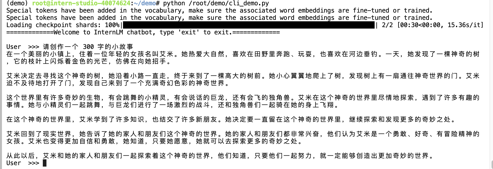
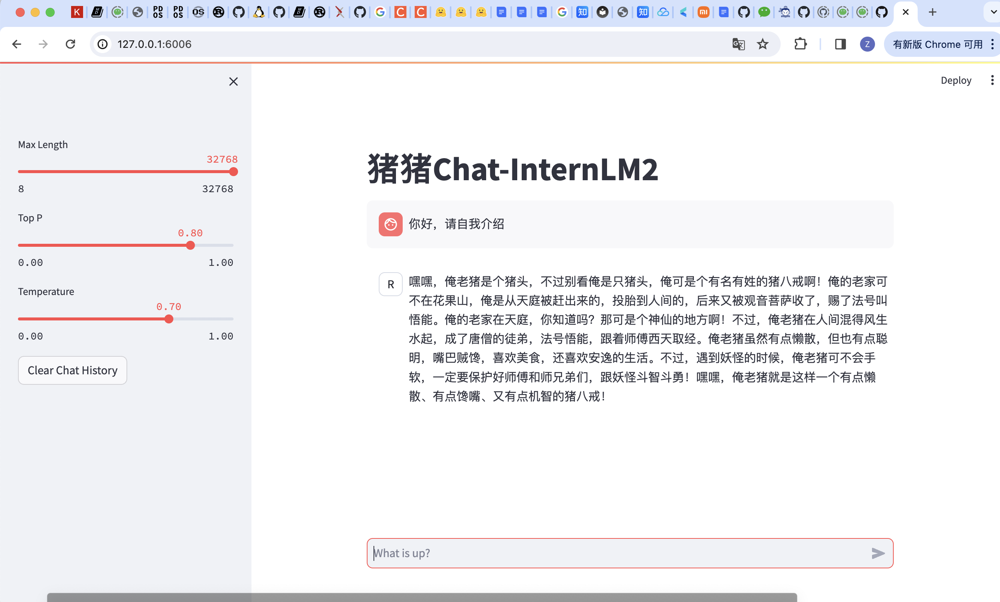
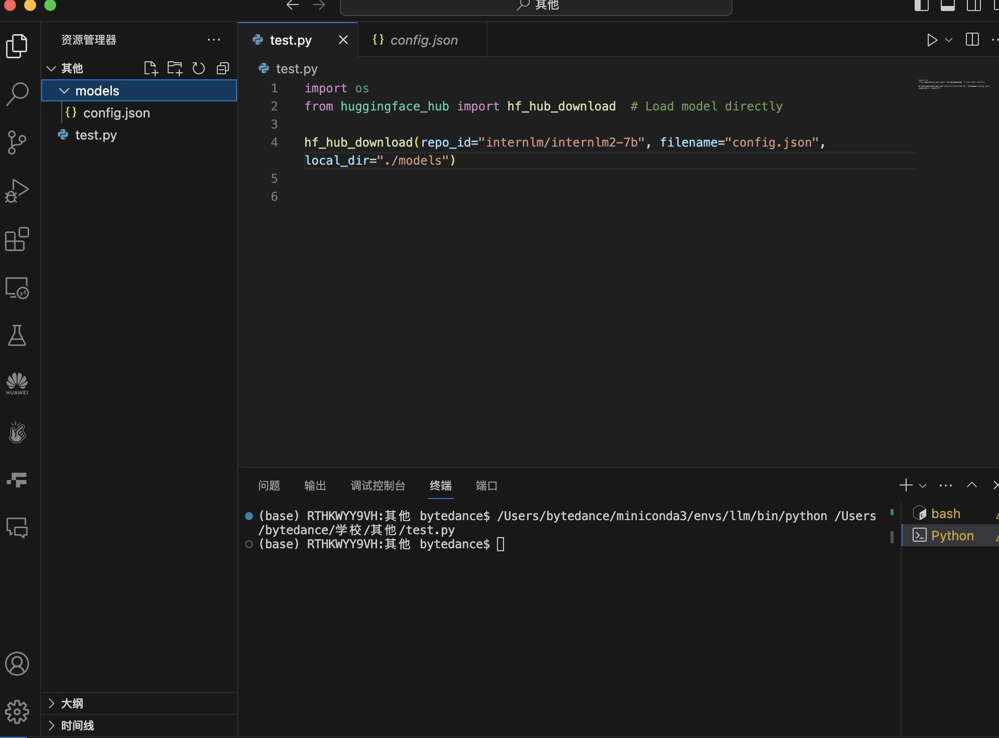
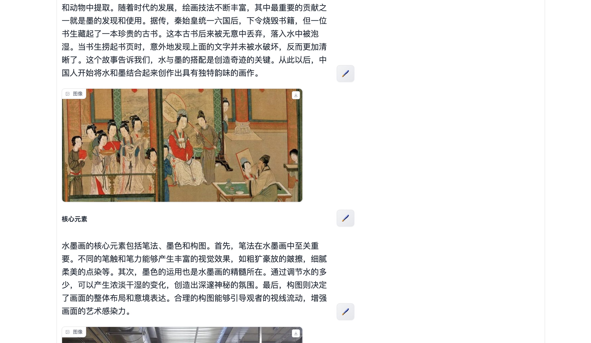
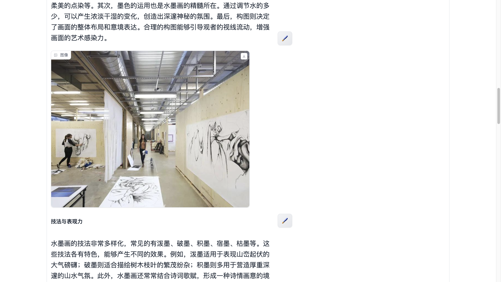
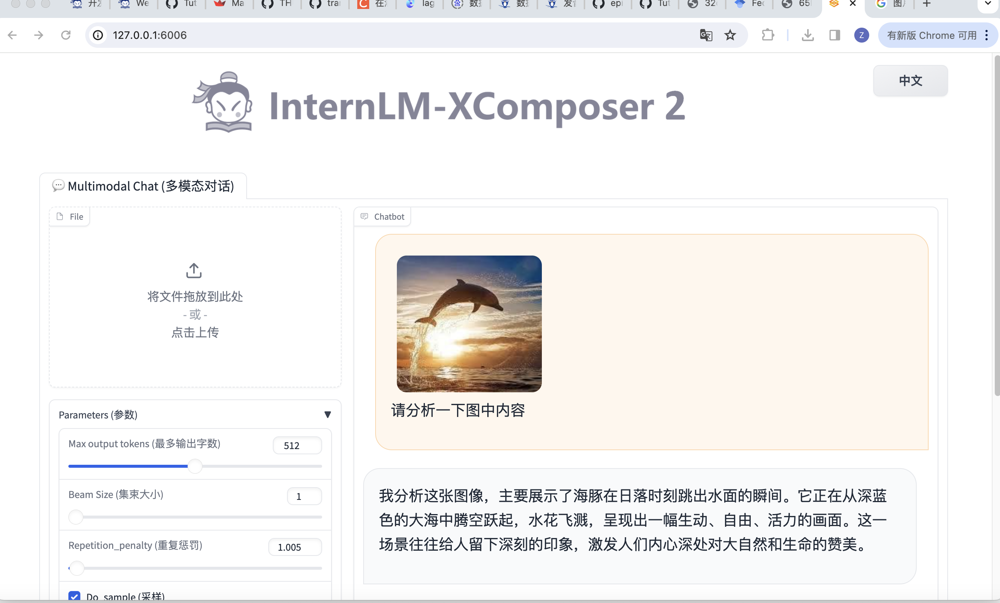
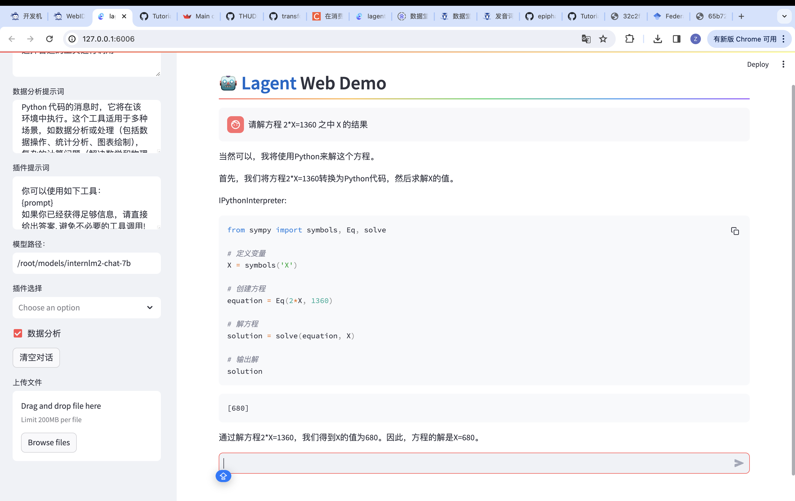

## 基础作业
1. 使用 `InternLM2-Chat-1.8B` 模型生成 300 字的小故事：

2. 使用八戒-chat生成：

## 进阶作业

1. 使用 huggingface_hub python 包，下载 InternLM2-Chat-7B 的 config.json 文件到本地:

2. 完成 `浦语·灵笔2` 的 图文创作 及 视觉问答 部署
    - 图文创作：
    
    
    
    - 视觉问答:
    

3. 完成 `Lagent` 工具调用 数据分析 Demo 部署

